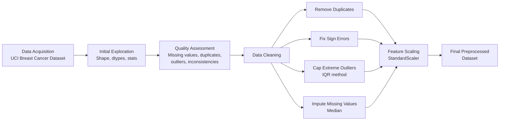

# data-cleaning-breast-cancer
Data acquisition, cleaning, and preprocessing pipeline on the UCI Breast Cancer Wisconsin (Diagnostic) dataset using Python. Covers missing value imputation, outlier detection &amp; treatment (IQR method), duplicate removal, inconsistency correction, and feature scaling — with full documentation of the reasoning behind each step.
# Data Cleaning & Preprocessing — Breast Cancer Wisconsin Dataset

A complete, real, executed data acquisition, cleaning, and preprocessing pipeline built in Python, using the **Breast Cancer Wisconsin (Diagnostic) Dataset** from the UCI Machine Learning Repository (accessed via `sklearn.datasets`).

## 📌 Project Overview

This project demonstrates a full real-world data cleaning workflow:
- Acquiring a genuine public dataset
- Assessing data quality (missing values, duplicates, inconsistencies, outliers)
- Cleaning the data using justified, documented techniques
- Scaling features to prepare the dataset for downstream modeling

Since the original UCI dataset is already clean, realistic data quality issues (missing values, duplicate rows, sign errors, extreme outliers) were **deliberately and transparently introduced** into a working copy to simulate real-world messiness — a standard practice for demonstrating a complete cleaning pipeline.

## 🔄 Pipeline



## 🧹 Cleaning Techniques Used

| Issue | Technique | Reasoning |
|---|---|---|
| Duplicate rows | `drop_duplicates()` | Exact duplicates bias statistics/models toward repeated records |
| Negative "mean area" values | Absolute value | Physically impossible negative measurement → sign error, not bad data |
| Extreme outliers | IQR capping (3x, wide bound) | Targets only clear data-entry errors, preserves genuine biological variation |
| Missing values | Median imputation | Robust to skew/outliers, unlike mean |

## 📊 Results

- **569 rows × 31 columns** processed
- 112 missing values → 0
- 6 duplicate rows → 0
- 5 invalid entries corrected
- All numeric features standardized (mean=0, std=1)

## 🛠️ Tech Stack

- Python 3
- pandas, NumPy
- scikit-learn (dataset + StandardScaler)
- Matplotlib (visualizations)

## ▶️ How to Run

```bash
pip install pandas numpy scikit-learn matplotlib
python data_cleaning_pipeline.py
```

## 📁 Output

Produces `final_preprocessed_dataset.csv` — a fully cleaned and scaled dataset ready for exploratory analysis or model building.
## 📁 Project Files

- `data_cleaning_pipeline.py` — Week 1: Data acquisition, cleaning & preprocessing
- `eda_visualization.py` — Week 2: Exploratory data analysis & visualization (builds on Week 1's cleaned dataset)

## 📈 Week 2 — Key Findings

- Identified top features separating malignant vs benign cases using statistical effect size (Cohen's d) and t-tests
- `worst concave points` and `worst perimeter` showed the strongest separation (Cohen's d > 2.3)
- Found that patients above the median `worst concave points` value are malignant 71.5% of the time, vs only 3.2% below median
- Detected a real anomaly: a visible imputation artifact from Week 1's cleaning step, showing up as an unnatural cluster of points in a scatter plot — a concrete example of how preprocessing choices affect downstream analysis
